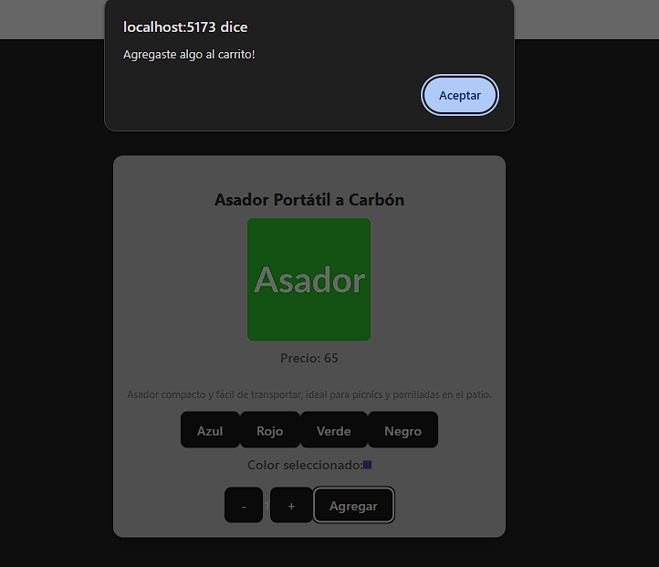
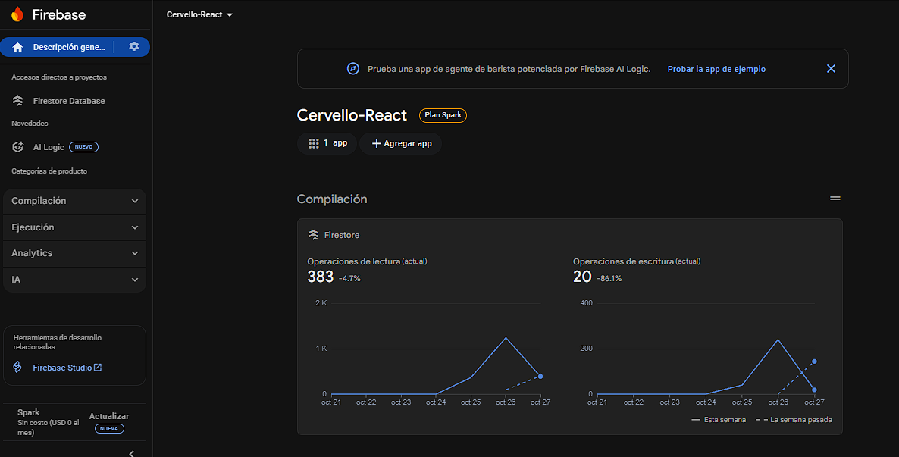

<div align="center">

# 🛒 E-Commerce React + Firebase

### *Una aplicación de comercio electrónico moderna construida con React y Firebase*

[](https://reactjs.org/)
[](https://firebase.google.com/)
[](https://vitejs.dev/)
[](https://reactrouter.com/)

[🚀 Demo](#-demo) • [📸 Capturas](#-capturas-de-pantalla) • [🛠️ Instalación](#-instalación) • [📖 Documentación](#-funcionalidades-detalladas)

</div>

---

## 📋 Descripción

Este proyecto es una **simulación completa de un e-commerce** desarrollado como parte del curso de React en **Coderhouse**. La aplicación permite a los usuarios navegar por productos, filtrarlos por categorías, agregarlos al carrito de compras y completar órdenes de compra. 

> 💡 Toda la información de productos y órdenes se gestiona a través de **Firebase Firestore** en tiempo real.

<br>

## ✨ Características Principales

<table>
<tr>
<td width="50%">

### 🎯 Funcionalidades Core
- 🏪 Catálogo de productos con visualización en grilla
- 🔍 Filtrado por categorías dinámico
- 📦 Detalle de producto con información completa
- 🛒 Carrito de compras persistente con Context API

</td>
<td width="50%">

### 🚀 Características Avanzadas
- ➕ Gestión de cantidades (agregar/quitar unidades)
- 💰 Cálculo automático del total de la compra
- 📝 Formulario de checkout con validación
- 🔥 Base de datos en tiempo real con Firebase Firestore

</td>
</tr>
<tr>
<td colspan="2">

### 🎨 Experiencia de Usuario
- 🎨 Selector de colores para productos
- 📱 Diseño responsive y adaptable
- ⚡ Carga rápida con Vite

</td>
</tr>
</table>

<br>

## 🚀 Demo

> [Aquí puedes agregar el link a tu deploy si lo tienes en Vercel/Netlify]

<br>

## 📸 Capturas de Pantalla

| Descripción | Imagen |
| :---: | :---: |
| Home de la página |  |
| Compra realizada exitosamente |  |
| La firebase |  |

<br>

## 🛠️ Tecnologías Utilizadas

<div align="center">

### Frontend

| Tecnología | Versión | Descripción |
|:----------:|:-------:|-------------|
| ⚛️ **React** | 19.1.1 | Librería para construir interfaces de usuario |
| 🧭 **React Router DOM** | 7.9.1 | Enrutamiento y navegación |
| ⚡ **Vite** | 7.1.2 | Build tool y dev server ultrarrápido |
| 🎨 **CSS3** | - | Estilos personalizados |

### Backend

| Tecnología | Versión | Descripción |
|:----------:|:-------:|-------------|
| 🔥 **Firebase** | 12.4.0 | Backend as a Service |
| 📊 **Firestore** | - | Base de datos NoSQL en tiempo real |

### Herramientas de Desarrollo

| Herramienta | Propósito |
|:-----------:|-----------|
| 🔍 **ESLint** | Linter para mantener código limpio |
| 🔌 **Vite Plugin React** | HMR y optimizaciones |

</div>

<br>

## 📁 Estructura del Proyecto

\`\`\`
📦 src/
┣ 📂 components/
┃ ┣ 📂 CartContainer/
┃ ┃ ┗ 📄 CartContainer.jsx
┃ ┣ 📂 ItemListContainer/
┃ ┃ ┣ 📄 ItemListContainer.jsx
┃ ┃ ┣ 📄 ItemDetailContainer.jsx
┃ ┃ ┣ 📄 Item.jsx
┃ ┃ ┗ 📄 ItemCount.jsx
┃ ┣ 📂 NavBar/
┃ ┃ ┗ 📄 NavBar.jsx
┃ ┣ 📄 ItemColorPick.jsx
┃ ┗ 📄 FormCheckout.jsx
┣ 📂 context/
┃ ┗ 📄 CartContext.jsx
┣ 📂 data/
┃ ┗ 📄 firebase.js
┣ 📄 App.jsx
┣ 📄 App.css
┗ 📄 main.jsx
\`\`\`

<br>

## 🎯 Funcionalidades Detalladas

### 🛒 Context API - Gestión del Carrito

El carrito de compras está gestionado mediante **Context API**, proporcionando las siguientes funciones:

<table>
<tr>
<th>Función</th>
<th>Descripción</th>
</tr>
<tr>
<td><code>addItem(product)</code></td>
<td>➕ Agrega un producto al carrito</td>
</tr>
<tr>
<td><code>removeItem(id)</code></td>
<td>🗑️ Elimina un producto del carrito</td>
</tr>
<tr>
<td><code>removeUnitFromItem(id)</code></td>
<td>➖ Disminuye la cantidad de un producto</td>
</tr>
<tr>
<td><code>clearCart()</code></td>
<td>🧹 Vacía el carrito completamente</td>
</tr>
<tr>
<td><code>countCartItems()</code></td>
<td>🔢 Cuenta el total de items en el carrito</td>
</tr>
<tr>
<td><code>countTotalPrice()</code></td>
<td>💵 Calcula el precio total</td>
</tr>
</table>

### 🗺️ Rutas de la Aplicación

<table>
<tr>
<th>Ruta</th>
<th>Componente</th>
<th>Descripción</th>
</tr>
<tr>
<td><code>/</code></td>
<td>ItemListContainer</td>
<td>🏠 Página principal con todos los productos</td>
</tr>
<tr>
<td><code>/category/:categParam</code></td>
<td>ItemListContainer</td>
<td>🏷️ Productos filtrados por categoría</td>
</tr>
<tr>
<td><code>/detalle/:idParam</code></td>
<td>ItemDetailContainer</td>
<td>🔍 Detalle específico de un producto</td>
</tr>
<tr>
<td><code>/cart</code></td>
<td>CartContainer</td>
<td>🛒 Visualización del carrito de compras</td>
</tr>
<tr>
<td><code>*</code></td>
<td>404</td>
<td>❌ Página no encontrada</td>
</tr>
</table>

<br>

## 🔧 Instalación

### 📋 Prerrequisitos

\`\`\`
✅ Node.js (versión 16 o superior)
✅ npm o yarn
✅ Cuenta de Firebase con proyecto configurado
\`\`\`

### 🚀 Pasos de Instalación

**1️⃣ Clona el repositorio**
\`\`\`bash
git clone https://github.com/AgustinCevello/CreaTuLandingCervello.git
\`\`\`

**2️⃣ Instala las dependencias**
\`\`\`bash
npm install
\`\`\`

**3️⃣ Configura Firebase**

Crea un archivo `src/data/firebase.js` con tu configuración:

\`\`\`javascript
import { initializeApp } from "firebase/app";
import { getFirestore } from "firebase/firestore";

const firebaseConfig = {
  apiKey: "TU_API_KEY",
  authDomain: "TU_AUTH_DOMAIN",
  projectId: "TU_PROJECT_ID",
  storageBucket: "TU_STORAGE_BUCKET",
  messagingSenderId: "TU_MESSAGING_SENDER_ID",
  appId: "TU_APP_ID"
};

const app = initializeApp(firebaseConfig);
export const db = getFirestore(app);
\`\`\`

**4️⃣ Inicia el servidor de desarrollo**
\`\`\`bash
npm run dev
\`\`\`

**5️⃣ Abre tu navegador**
\`\`\`
http://localhost:5173
\`\`\`

<br>

## 📦 Scripts Disponibles

| Comando | Descripción |
|---------|-------------|
| `npm run dev` | 🚀 Inicia el servidor de desarrollo |
| `npm run build` | 📦 Crea el build de producción |
| `npm run preview` | 👀 Previsualiza el build de producción |
| `npm run lint` | 🔍 Ejecuta el linter |

<br>

## 🔥 Configuración de Firebase

### 📊 Estructura de Firestore

**Colección: `products`**
\`\`\`javascript
{
  id: "producto-1",
  title: "Nombre del producto",
  price: 1999.99,
  description: "Descripción detallada",
  category: "categoria-ejemplo",
  img: "url-imagen.jpg",
  stock: 10
}
\`\`\`

**Colección: `orders`** *(generada por el checkout)*
\`\`\`javascript
{
  buyer: {
    username: "Nombre",
    email: "email@ejemplo.com",
    phone: "1234567890"
  },
  items: [...],
  total: 5999.97,
  date: Timestamp
}
\`\`\`

<br>

## 🎨 Personalización

### 🖌️ Estilos
Los estilos están organizados por componente. Para modificar el tema general:

1. Edita `App.css` para estilos globales
2. Modifica los archivos `.css` individuales de cada componente

### 🏷️ Agregar Nuevas Categorías
1. Agrega productos con la nueva categoría en Firebase
2. Actualiza el componente NavBar con el nuevo link

<br>

## 🤝 Contribuciones

Las contribuciones son **bienvenidas**. Para cambios importantes:

\`\`\`
1. 🍴 Fork el proyecto
2. 🌿 Crea una rama para tu feature (git checkout -b feature/AmazingFeature)
3. 💾 Commit tus cambios (git commit -m 'Add some AmazingFeature')
4. 📤 Push a la rama (git push origin feature/AmazingFeature)
5. 🔀 Abre un Pull Request
\`\`\`

# 🚀 Puesta en Marcha

> Para descargar las dependencias e iniciar el proyecto de forma local, sigue estos sencillos pasos desde la terminal:

---

## 📥 1. Instalar Dependencias

Abre tu terminal en la carpeta raíz del proyecto y ejecuta:

```bash
npm install
```

<details>
<summary>💡 ¿Qué hace este comando?</summary>

<br>

Este comando descarga e instala todas las dependencias necesarias listadas en el archivo `package.json`, incluyendo React, Firebase, React Router y todas las herramientas de desarrollo.

</details>

---

## ▶️ 2. Ejecutar el Proyecto

Una vez instaladas las dependencias, inicia el servidor de desarrollo:

```bash
npm run dev
```

<details>
<summary>💡 ¿Qué sucede después?</summary>

<br>

Esto abrirá la aplicación en tu navegador en **`http://localhost:5173/`**

Verás un mensaje en la terminal con la URL local donde se está ejecutando tu aplicación. ¡Simplemente haz clic o copia la URL en tu navegador!

</details>

---

### ✅ ¡Listo!

Con estos dos simples pasos, tu aplicación estará corriendo localmente y lista para usar.

---

<div align="center">

**🎉 ¡Disfruta explorando el proyecto! 🎉**


<br>

## 🔮 Mejoras Futuras

<table>
<tr>
<td width="50%">

### 🔐 Autenticación y Usuarios
- [ ] Implementar autenticación de usuarios
- [ ] Sistema de favoritos
- [ ] Panel de administración

</td>
<td width="50%">

### 🎨 UI/UX
- [ ] Notificaciones toast en lugar de alerts
- [ ] Animaciones y transiciones
- [ ] Dark mode

</td>
</tr>
<tr>
<td width="50%">

### 🔍 Funcionalidades
- [ ] Búsqueda de productos
- [ ] Paginación al listado
- [ ] Sistema de reseñas y calificaciones

</td>
<td width="50%">

### 📊 Otros
- [ ] Métricas y analytics
- [ ] Optimización de imágenes
- [ ] PWA support

</td>
</tr>
</table>

<br>

## 👨‍💻 Autor

<div align="center">

**Cervello Agustín**

[](https://github.com/AgustinCevello)
[](https://www.linkedin.com/in/agust%C3%ADn-cervello-b04b37235/)

</div>


## 🙏 Agradecimientos

- 🎓 **Coderhouse** por la formación en React
- 🔥 **Firebase** por su excelente documentación
- ⚛️ La **comunidad de React** por los recursos

---

<div align="center">

### ⭐️ Si te gustó este proyecto, ¡dale una estrella en GitHub!

**Desarrollado con ❤️ y React**

</div>
